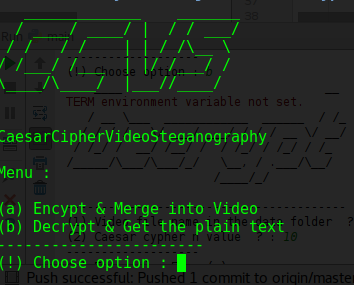
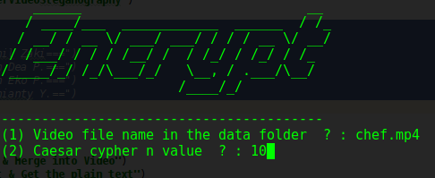

# Caesar-Cipher-Video-Steganography(CCVS)

CCVS is a simple program written in python to hide encrypted text using simple caesar cipher in video frames, the encryption algorithm could be easily changed because the cipher algorithm is loosly coupled. 

Dependencies :

* ffmpeg
* opencv 
* PIL
* pyfiglet

Usage : 

* write your plain text in text-to-hide.txt in <strong> data </strong> folder

```bash
python main.py

```
you'll be greet with the main menu to encrypt the plain text and hide it in the video or decrypt and retreive the plain text from the video 





For decryption plain text will be put in recovered-text.txt in data folder

Warning :
* For encryption the video will be converted into raw .mov video to make sure data in the video won't change after re encoding and decryption, and make sure you got enough space (For comparison : 2 minute of 720p video could result in 2GB raw .mov video)
* temp folder will be created to dump temporary extracted frame , audio, and video.
* the temp foldder will be created in case of extraction either decryption
